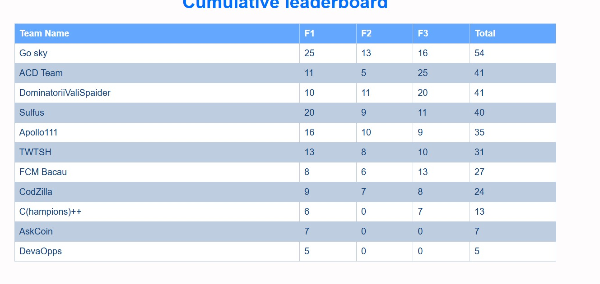

# ml_win_logs_anomalies

## Machine Learning - Detection of Anomalies within Windows System Logs

## FIRST PLACE at Eestec Olympics Main Challange Hackathon (Bitdefender) - Machine Learning

Task:
The task is to classify windows system logs to identify abnormal behavior. The input consists of a list of json events, one event per file, where the data must be first extracted as the tcp payload from a pcap file. Training event files contain a "label" key that represents the correct classification. You have access to sample.zip containing a few example events to better understand the data, but the training will be done during evaluation on a private dataset. Evaluating the submission is done by running your startScript.sh in an isolated container running Ubuntu, with the following structure:

* /usr/src/app/DataFolder - the folder that contains needed packages to be installed offline
* /usr/src/app/DataFolder/packageScript.sh - the script that will be ran to install the packages
* /usr/src/app/InputData/test - test files (unlabeled)
* /usr/src/app/InputData/train - training files (labeled)
* /usr/src/app/source - the folder where the main project will be copied to
* /usr/src/app/source/startScript.sh - the script that will be ran to start the project
* /usr/src/app/output/labels - the file where the output must be written

The output must be a json file with the expected label for each test file name. Running a submission is limited to 2 minutes. You will have to decide how to optimize the solution to process as much data as possible. The container doesn't have internet access so if you need to install packages you have to upload a separated archive that is ran before the main submission and perform offline installation. This does not count towards the 2 minute limit.

